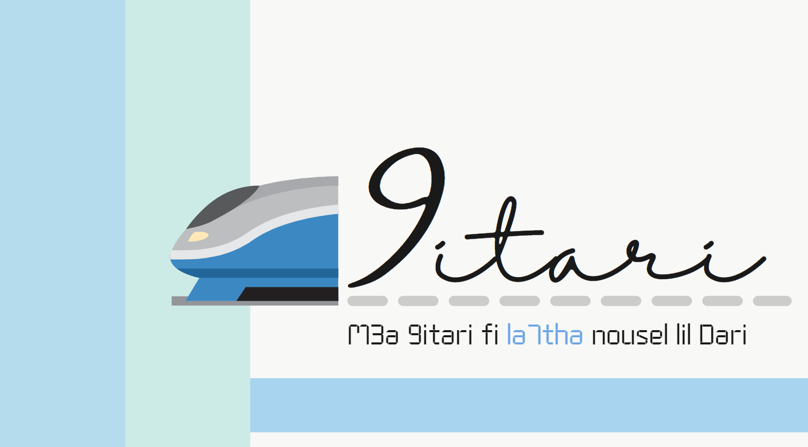

## 9itari : Mobile Development Project using Agile methodologies

It's a mobile application developed with Flutter which facilitates travelers' use of trains on a day-to-day basis and helps administrators manage train data easily in Tunisia.To help build and manage our project , we applied Agile methodologies and Scrum using Jira software and were able to organize our work into sprints. 
> **_NOTE:_**  this is the backend of the actual project where you can find the frontend through [this link](https://github.com/HadilHelali/9itariProjectFront)

## Project Presentation and Demo

## Collaborators
This project was developed by :
| Raoua Trimech | Hadil Helali |
| --- | --- |
